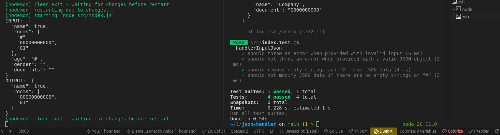
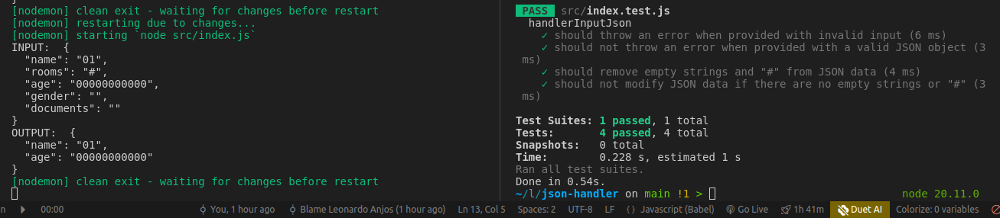

# json-handler

validate and transformer json data

problem: receiving a set of data in JSON format and removing all empty fields ('') or those containing the special character (#)

- install node dependencies `yarn`
- run application in development mode with nodemon `yarn start`
- execute tests `yarn test`

obs: with each modification or `ctrl + s` in the `index.js` file a new random data is generated and return the transformed data





### examples
```
input: {
  'name': '',
  'rooms': ['', '01', '#', '02'],
  'age': '#',
  'gender': 'M',
  'companies': {
    'name': '#',
    'document': '0000000000'
  }
}

output: {
  'rooms': ['01', '02'],
  'gender': 'M',
  'companies': {
    'document': '0000000000'
  }
}
```